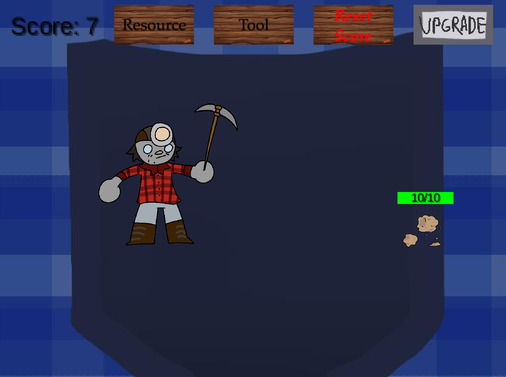

# Software Design Documentation

### Project Overview
Pocket Miner is a 2D arcade-style click-based mining game developed using the LibGDX framework. The primary objective is to create a dynamic, touch-interactive gameplay experience where players alternate between tools and resources to accumulate points. The game focuses on simplicity and the ability to be replayable, emphasizing real-time resource collection and score tracking. A central feature of the project is the implementation of an autosave system, designed to automatically preserve the player's progress at regular intervals or after key gameplay events.
- **Game Name**: Pocket Miner
- **Genre**: Arcade
- **Platform**: PC
- **Engine**: [LibGDX](https://libgdx.com/)

### Objectives
-	Implement gameplay features like resource gathering, tool switching, and scorekeeping.
-	Create an autosave system to preserve progress.
________________________________________
	
##  Design
### Overall System Design
Provide a diagram of the architecture. This could include:
- The main game loop (render(), update(), etc.).
-	Core components (Game logic, UI, Input handling, Game state management).
-	Dependencies (LibGDX libraries, JSON handling for saving/loading, etc.).

### Component Breakdown
-	**Main class (Main):**
-	Handles game loop (render(), create(), resize()).
-	Manages input (input()).
-	Manages visual components (sprites, font, UI).
-	Controls gameplay logic like resource gathering, tool-switching, etc.

•	Save System:
-	Saves player state (score, tool, resource) using Preferences and/or JSON.
-	Autosaves based on time or events.

•	UI/Graphics:
-	Manages SpriteBatch, Texture, and Sprite for rendering game assets.
-	Displays HUD elements like the score.

________________________________________
## Example

 **Here's what the code looks like while it is running**

________________________________________
## Status

Give the current status of the software. List what is working and what is planned for future releases. When listing planned features, assume that the the project will continue even after the course ends.
### Potential Enhancements
-	Cloud Saving: Implement a cloud save feature to allow players to save progress across devices.
-	Sound and Animation: Add more complex animations (fade-in/out) and sound effects.
-	Game Difficulty: Increase the difficulty by introducing new resources, locations, tools, or time limits.
-	Upgrade menu: Reworking the way that tools and resources were changed to allow for the upgrade menu to be more relevant.

### Known Limitations
-	Save System: Currently, only score and resources are saved, but other aspects like player preferences or game state can be added in future updates.
-	Upgrade Menu: In its current state the upgrade screen is a placeholder that doesn’t do anything.

---------------------------------------------

# Documentation generated by LibGDX

# pocket-miner

A [libGDX](https://libgdx.com/) project generated with [gdx-liftoff](https://github.com/libgdx/gdx-liftoff).

This project was generated with a template including simple application launchers and a main class extending `Game` that sets the first screen.

## Platforms

- `core`: Main module with the application logic shared by all platforms.
- `lwjgl3`: Primary desktop platform using LWJGL3; was called 'desktop' in older docs.

## Gradle

This project uses [Gradle](https://gradle.org/) to manage dependencies.
The Gradle wrapper was included, so you can run Gradle tasks using `gradlew.bat` or `./gradlew` commands.
Useful Gradle tasks and flags:

- `--continue`: when using this flag, errors will not stop the tasks from running.
- `--daemon`: thanks to this flag, Gradle daemon will be used to run chosen tasks.
- `--offline`: when using this flag, cached dependency archives will be used.
- `--refresh-dependencies`: this flag forces validation of all dependencies. Useful for snapshot versions.
- `build`: builds sources and archives of every project.
- `cleanEclipse`: removes Eclipse project data.
- `cleanIdea`: removes IntelliJ project data.
- `clean`: removes `build` folders, which store compiled classes and built archives.
- `eclipse`: generates Eclipse project data.
- `idea`: generates IntelliJ project data.
- `lwjgl3:jar`: builds application's runnable jar, which can be found at `lwjgl3/build/libs`.
- `lwjgl3:run`: starts the application.
- `test`: runs unit tests (if any).

Note that most tasks that are not specific to a single project can be run with `name:` prefix, where the `name` should be replaced with the ID of a specific project.
For example, `core:clean` removes `build` folder only from the `core` project.
